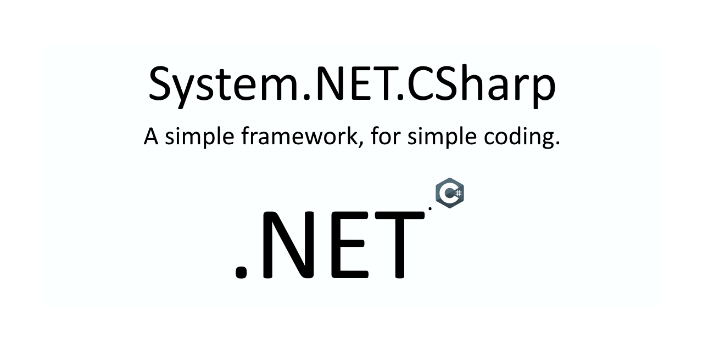

# System.NET.CSharp
### INFORMATION
Before you go anywhere, please note that this library is ***not*** an **addition** to the **System.Net** libraries.
There is a big difference between the letter casing of Net and NET.

### DOWNLOAD
If you want to download any of the releases, go [here](https://github.com/sh4d0w4RCH3R415/System.NET.CSharp/releases/). 
If you want to download the *latest* release, go [here](https://github.com/sh4d0w4RCH3R415/System.NET.CSharp/releases/1.1).

The ***latest release*** link will have the new release link anytime I upload a new release, so keep checking this repository for new releases.

### OTHER STUFF
I will try to update this [README.md](https://github.com/sh4d0w4RCH3R415/System.NET.CSharp/blob/master/README.md) regulary, but it will be a challenge since I do have other things that I like to do.
Most of the time I am just finding solutions to problems with code, or just trying to find ways to improve my other projects, but I ***will*** make sure that you guys get the
latest from this repository and its releases.

### GitHub Badge Generator
The badges were made with an app I ***just*** released called [***GitHub Badge Generator***](https://github.com/sh4d0w4RCH3R415/GitHub-Badge-Generator/releases/free-download/).
